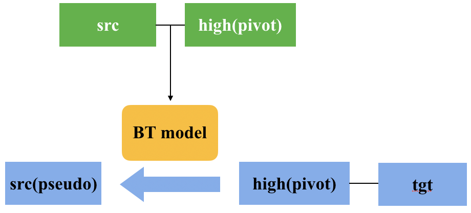

## WMT21 Multilingual Low-Resource Translation for Indo-European Languages shared task

http://statmt.org/wmt21/multilingualHeritage-translation-task.html

-  **Romance languages**: **from Catalan to Occitan, Romanian and Italian**（one-to-many）

## 1. Statistics of all training data

### 1.1 Low-resource languages parallel data

No filter low-resource bilingual data can be found [here](https://share.weiyun.com/zlMKEK6m)


- (Task directions sentence pairs) ca→oc/ro/it 

|           | ca-oc  | ca-ro | ca-it |
| --------- | ------ | ----- | ----- |
| No filter | 138.7K | 2.2M  | 6.3M  |
| Filtered  | 138.7K | 2.1M  | 5.8M  |

- (Task directions)filtered bilingual data we use for training can be found in: [bpe_link](https://share.weiyun.com/XkaaG2D2)，[spm_link](https://share.weiyun.com/XkaaG2D2)（used in fine-tuning pre-trained model m2m-100）

  

- (Sentence pairs between target low resource languages) **oc-ro-it**


|           | it-ro | it-oc | oc-ro |
| --------- | ----- | ----- | ----- |
| No filter | 7.2M  | 122K  | 81K   |
| Filtered  | 6.9M  | 122K  | 81K   |

### 1.2 High-low resource paired data

- We use 4 related rich languages es/en/fr/pt in the same language family for training.

| No filter | it    | oc   | ro    | ca    |
| --------- | ----- | ---- | ----- | :---- |
| **en**    | 22.4M | 73K  | 14.6M | 7.1M  |
| **es**    | 4.4M  | 36K  | 6.4M  | 12.3M |
| **fr**    | 4.8M  | 124K | 1.6M  | 7.7M  |
| **pt**    | 24.3M | 24K  | 5.7M  | 4.9M  |

| [Filtered](https://share.weiyun.com/SWJtEbnK) | it    | oc   | ro    | ca   |
| --------------------------------------------- | ----- | ---- | ----- | ---- |
| **en**                                        | 22.3M | 59K  | 14.5M | 7.0M |
| **es**                                        | 4.3M  | 36K  | 4.2M  | 6.5M |
| **fr**                                        | 4.7M  | 124K | 1.5M  | 7.0M |
| **pt**                                        | 15.6M | 24K  | 5.6M  | 4.6M |

### 1.3  Monolingual data of low-resource languages

- De-duplicated monolingual data can be found [here](https://share.weiyun.com/rx2SS2qN)

|           | it    | oc   | ro     |
| --------- | ----- | ---- | ------ |
| No filter | 275M  | 378K | 193.5M |
| Filtered  | 38.3M | 225K | 13.4M  |

### 1.4 Data filtering

We  partially refer to m2m-100 data preprocessing(except for frequency cleaning) in FAIRSEQ.

https://github.com/pytorch/fairseq/tree/374fdc5cd94d361bb9b1089fe2c1d30a2eb15fdd/examples/m2m_100

```
# remove sentences with more than 50% punctuation
# deduplicate training data
# remove all instances of evaluation data from the training data
# apply bpe/spm
# length ratio cleaning
```

## 2. System Overview

### 2.1 Baseline

- ca→oc/ro/it：we utilize a unified encoder/decoder model for all languages.


**Multi-bleu** results on validation set:

|      | oc   | ro    | it    | AVG BLEU |
| ---- | ---- | ----- | ----- | -------- |
| ca   | 43.4 | 24.16 | 32.92 | 33.78    |

- Besides, we also experiment：
  - Training 1-1 dedicated bilingual models  
  - Joint training on ca/oc/ro/it simultaneously（many-to-many multilingual model ）

**Multi-bleu** results on validation set:

|      | ca-oc | ca-ro | ca-it | AVG BLEU |
| ---- | ----- | ----- | ----- | -------- |
| 1-1  | -     | -     | 33.91 |          |
| 1-1  | 30.02 | -     | -     | 28.48    |
| 1-1  | -     | 21.51 | -     |          |
| 4-4  | 41.44 | 22.81 | 31.01 | 31.75    |

### 2.2 Pivot

- synthetic data generated by pivot-based method can be found [here](https://share.weiyun.com/JoF7Dkc0)

  

Considering high-low resource bilingual data，we train a **high(pivot) → src** multilingual model for the purpose of back-translation. And the target side used for back translation is high(pivot) in **high(pivot) → tgt** bilingual data，so we get **src(pseudo) → tgt** bilingual data.

In the experiment, we train a high→ca multilingual model for BT, and we back-translate high-resource data in high--oc/ro/it to get ca→oc/ro/it pseudo data.



Note：to balance genuine and pseudo data distribution, we oversample genuine bilingual data to be of the same magnitude as synthetic data.

**Multi-bleu** results on validation set:

|      | oc    | ro    | it   | AVG BLEU |
| ---- | ----- | ----- | ---- | -------- |
| ca   | 26.98 | 26.33 | 34.2 | 29.17    |

### 2.3 Back translation

- Back-translated data concatenated with genuine bilingual data can be found [here](https://share.weiyun.com/4opMQTUO)

  

Back-translation is an effective and commonly used data augmentation technique to incorporate monolingual data into a translation system.

- ca→it：since the parallel data in this direction is relatively rich compared to the other two directions, we train an individual BT model.
- ca→oc/ro：because these two directions are facing parallel data-scarce problem, so that we utilize the many-to-many multilingual model that trained on 4 low-resource languages previously to perform back-translation, rather than use a dedicated bilingual model.

We straightly use pseudo data to train a multilingual model from scratch, followed by fine-tuning on genuine parallel data.

**Multi-bleu** results on validation set:

|      | oc    | ro    | it   | AVG BLEU |
| ---- | ----- | ----- | ---- | -------- |
| ca   | 48.21 | 22.66 | 32.9 | 34.59    |

### 2.4 High-low 8-4 multilingual model

- genuine bilingual data can be found [here](https://share.weiyun.com/SWJtEbnK)

- 8-4 multilingual model can be found in [models.zip](https://share.weiyun.com/MxEdRufd)

  

Training multiple language pairs together may result in transfer learning. Bringing related high-resource language pairs in the same linguistic family should help gain a boost in low-resource language pairs.

- We utilize **high--low** resource paired data as well as pairs between low-resource languages, to jointly train an **8-4 multilingual model**. As for each high-low resource language pairs, we extract 2K sentences from training data as the validation set. 
  - 8：means 4 high-resource languages plus 4 low-resource languages (en es pt fr + ca oc ro it)
  - 4：means 4 low-resource languages (ca oc ro it)

**Multi-bleu** results on validation set:

|      | oc    | ro    | it    | AVG BLEU |
| ---- | ----- | ----- | ----- | -------- |
| ca   | 51.49 | 29.11 | 38.26 | 39.62    |


### 2.5 Combine all data

- Combine-All **bpe** data can be found in [combine-all-bpe.tar.gz](https://share.weiyun.com/gttlVPHx)、Combine-All **spm** data can be found in [combine-all-spm.tar.gz](https://share.weiyun.com/EfyEfZDw).

- Combine-All model can be found in [models.zip](https://share.weiyun.com/MxEdRufd)

  

when we have synthetic parallel data generated from BT and pivot, we can combine all genuine and synthetic parallel data together to jointly train a multilingual model named **Combine-All** with four high-resource plus four low-resource languages as its source side and four low-resource languages as its target side.

**Multi-bleu** results on validation set:

|      | oc    | ro    | it    | AVG BLEU |
| ---- | ----- | ----- | ----- | -------- |
| ca   | 26.75 | 29.59 | 37.49 | 31.28    |

### 2.6 Pretrain

- rich-m2m-KD model can be found in [models.zip](https://share.weiyun.com/MxEdRufd)

  

In addition to the above methods, we also experiment with pre-trained models that trained on massive text to transfer knowledge into the target task.

We employ open resource pre-trained model m2m-100, the experiments are based on the m2m-100 1.2B_last checkpoint:

| encoder-embed-dim | encoder-ffn-embed-dim | encoder-attention-heads | encoder layers |
| ----------------- | --------------------- | ----------------------- | -------------- |
| 1024              | 8192                  | 16                      | 24             |

- Parameter settings in fine-tuning is the same as fine-tuning mBART.
- ca--oc：firstly we employ multilingual fine-tuning on the pre-trained model till the updates reach 200K/1.1M, after that we continue with bilingual fine-tuning using genuine parallel data.
  - We try merely use genuine data or use genuine data concatenated with pseudo data in multilingual fine-tuning and we finally adopt the latter one.
- ca--ro：since the results after multilingual/bilingual fine-tuning do not show improvement over the original pre-trained model, so we directly utilize pre-trained model without fine-tuning.

We exploit ca--oc、ca--ro data obtained through sentence-level knowledge distillation and continue to train on 8-4 multilingual model trained above. Finally, we get a new model named **rich-m2m-KD**.

**Multi-bleu** results on validation set:

|      | oc    | ro    | it    | AVG BLEU |
| ---- | ----- | ----- | ----- | -------- |
| ca   | 65.18 | 32.85 | 36.19 | 44.74    |

## 3. Domain adaptation

- rich-indomain-ft model can be found in [models.zip](https://share.weiyun.com/MxEdRufd)

  

Validation and test set belong to the cultural heritage domain, whereas domains in training data are various, so domain adaptation is required.

We utilize pre-train model  https://huggingface.co/bert-base-multilingual-cased to train a domain classifier.

- Parameters：

|                              | lr   | epochs | batch-size |
| ---------------------------- | ---- | ------ | ---------- |
| bert_base_multilingual_cased | 3e-5 | 4      | 16*8       |

- Positive samples for training a classifier：validation sets of 3 languages ca/ro/it.
- We select parallel data whose source side is predicted to be positive with a probability > 0.7 as the in-domain corpus, then we fine-tune on 8-4 multilingual model with a smaller learning rate. Finally, we get another model named **rich-indomain-ft**.

Selected indomain data can be found [here](https://share.weiyun.com/c7V7LHBJ):

|      | it     | oc    | ro     |
| ---- | ------ | ----- | ------ |
| Ca   | 814797 | 59844 | 296811 |

**Multi-bleu** results on validation set:

|      | oc   | ro   | it    | AVG BLEU |
| ---- | ---- | ---- | ----- | -------- |
| ca   | 56.6 | 28.3 | 38.74 | 41.21    |

## 4. Ensemble

- Contrastive system：rich-m2m-KD, rich-indomain-ft, Combine-All.
- Primary system：rich-m2m-KD, rich-indomain-ft

**Multi-bleu** results on validation set:

|             | ca-oc | ca-ro | ca-it | AVG BLEU |
| ----------- | ----- | ----- | ----- | -------- |
| Contrastive | 64.02 | 32.63 | 40.04 | 45.56    |
| Primary     | 64.7  | 32.85 | 39.41 | 45.65    |
