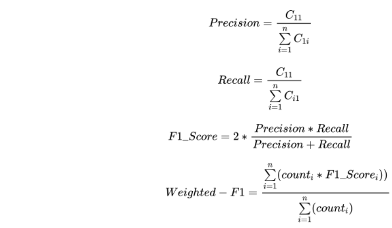

# 跨语言迁移评测：中文到民族语言 (CMXT) 
### Chinese-Minority Cross-lingual Transfer Evalutaion (CMXT)
[中文-民语跨语言迁移评测-CMXT官方Github](https://github.com/TenTrans/TenTrans/edit/master/examples/CMXT)
## 一、任务介绍
### 1、任务背景
　近年来，基于预训练+Finetune的NLP范式已经成为业界主流做法，除了关注在单个语言上的预训练技术探索之外，**跨语言迁移技术**被学术界和工业界广泛关注。有以下几点原因：
- 预训练阶段，为每个语言单独训练一套基于大规模数据的预训练模型代价非常高，而训练一个多语言预训练模型可以降低训练代价。
- 微调阶段，有些低资源语种标注数据极其稀缺，标注代价比较高，但是主流语种如英语和汉语标注数据相对充分，可以借助跨语言技术提升小语种理解能力。
- 简单混合大规模多语言语料训练的多语言预训练模型具备一定的跨语言能力，如mBERT、mT5。

　学术界所使用的跨语言数据集是都以英文为Pivot（如[XTREME](https://sites.research.google/xtreme "XTEME")，Google举办）且主要涉及境外主流语种（如法、德、西等），但对国内的民族小语种缺乏关注，如mBERT模型不能支持维、藏、粤、传统蒙古语、传统哈萨克语。国内研究者比较关注的评测是中文语言理解基线评测[CLUE](https://www.cluebenchmarks.com/ "CLUE")，该评测主要关注中文的理解任务，如果分类、阅读理解、问答等，对于跨语言和民族语言任务没有涉及。
  
　为了更好推动国内民族语言信息技术发展，腾讯信息安全部小语种理解团队开放了3个基于国内民族语言的跨语言数据集和基线，并开放了用于预训练的大量民语单语语料。任务涉及：**跨语言话题分类，跨语言正文与标题匹配，跨语言短文检索**。语种涉及：维、藏、传统蒙古语、粤语、传统哈萨克语，朝鲜语、汉语、英语8个语种。(注明：为了方便大家模型调优，我们引入英文)

### 2、任务介绍
#### 任务1：跨语言话题分类
该任务是基于跨语言的话题分类任务，我们定义了23个话题领域标签（如政治、军事、法治等），在中文上训练话题分类任务，在其他语言上做分类预测。该任务提供上述8个语种的单语语料用于预训练、中文分类标注数据、小语种开发集、小语种测试A/B集，具体细节参照第二部分([评测数据](#data))。
#### 任务2：跨语言正文与标题匹配
该任务是基于跨语言的正文和标题匹配任务，在中文上训练匹配任务，在其他语言上做匹配预测。匹配任务目标是：使用文章正文，从标题候选里选择该文章的恰当标题。该任务提供用于预训练的单语数据、中文文章-标题标注数据、小语种开发集、小语种测试A/B集，具体细节参照第二部分([评测数据](#data))。
#### 任务3：跨语言短文检索
该任务是基于跨语言的短文检索任务，通过训练更好的跨语言表示，利用小语种单语数据在候选中文数据里，检索到和它语义相同的中文短文句子。该任务提供用于预训练的单语数据、小语种开发集和测试集A/B，具体细节参照第二部分([评测数据](#data))。
### 3、注意事项
- **可以**使用任何开源的预训练语言模型如mBERT、XLM-R、mT5等，但需要在提交系统结果时，“CCL22-CMXT结果提交表—外部技术使用说明”部分注明使用何种预训练模型以及相应参数配置；
- **可以**使用除了官方提供的单语语料以外的任何开源单语语料，但需要在提交系统结果时，“CCL22-CMXT结果提交表—训练数据使用说明”注明使用哪些开源数据以及语料大小、tokens数，分语种说明清楚；
- **不可以**将开发集和测试集A加入到训练集中。开发集只能用于模型调优，测试集A用于效果验证；
- **不可以**使用官方提供和指明的平行语料以外的任何平行语料；
- **需要先提交测试集A模型预测结果**方可下载测试集B，测试集A结果仅供组织方参考。
- 对于本次比赛的所有任务，我们在第一阶段开放用于预训练的单语和平行语料；在第二阶段开放用于任务微调的训练集、开发集、测试集A；在第三阶段开放无答案的测试集B，参赛者提交测试集B上的模型结果后，我们以**测试集B自动评价结果**作为每个任务排名的依据（参照[客观评价指标](#evaluation)部分说明）。评测整体排名标准参照[赛事排名标准](#rank)说明。

## 二、评测数据
 
### 1、预训练数据
#### 单语数据（非受限）
|语种   | 数据量  | 链接  | 备注  |
| :------------ | :------------ | :------------ | :------------ |
| 维语(ug)  | 18GB  | [cmxt22_ug_mono_218g](https://share.weiyun.com/htMwWO18)  | 主要来源: 公众号、新闻语料|
| 藏语(bo)  | 15GB  | [cmxt22_bo_mono_15g](https://share.weiyun.com/zhfXphD5)  | 主要来源: 公众号、新闻语料|
| 粤语(ct)  | 2.0GB  | [cmxt22_ct_mono_2.0g](https://share.weiyun.com/5m6I8SMD)  | 主要来源: 公众号、新闻语料|
| 传统哈萨克语(kk)  | 644MB  | [cmxt22_kk_mono_644m](https://share.weiyun.com/yrLO92ol)  | 主要来源: 公众号、新闻语料  |
| 传统蒙古语(mn)  | 3GB  |[cmxt22_mn_mono_3g](https://share.weiyun.com/UjxBP9WS)  | 主要来源: 公众号、新闻语料  |
| 朝鲜语(ko)  | -  | 推荐使用[CCNet](https://github.com/facebookresearch/cc_net)  |   |
| 汉语(zh)  | -  |推荐数据[CLEUCorpus2020](https://github.com/CLUEbenchmark/CLUECorpus2020)  |   |
| 英语(en)  |  - |  推荐数据[WMT Corpus](https://statmt.org/wmt22/translation-task.html)   |   |

**下载密钥获取方式：**
- CMXT评测期间：填写第四部分报名表，组织方发邮件告知
- 非评测期间：Email bojiehu@tencent.com(主送) nlpbojiehu@163.com, zatozhang@tencent.com (抄送)，邮件主题：“申请下载CMXT数据”， 邮件正文：“注明具体申请哪些数据、用途、目前所在单位” 
#### 平行语料（**受限**）
|语种   | 数据量（行数）  | 链接  | 备注  |
| :------------ | :------------ | :------------ | :------------ |
| 维汉  | 200万  | [cmxt22_ug2zh_bitext_200w](https://share.weiyun.com/mgS1w6Qm)  | 腾讯民汉翻译维汉机翻数据|
| 藏汉  | 200万  | [cmxt22_bo2zh_bitext_200w](https://share.weiyun.com/01EnWoxw)   | 腾讯民汉翻译藏汉机翻数据 |
| 粤汉  | 200万  | [cmxt22_ct2zh_bitext_200w](https://share.weiyun.com/iDgsOom2)   | 腾讯民汉翻译粤汉机翻数据 |
| 哈汉  | 200万  | [cmxt22_kk2zh_bitext_200w](https://share.weiyun.com/Ir3CEXw5)   | 腾讯民汉翻译哈汉机翻数据|
| 蒙汉  | 200万  |[cmxt22_mn2zh_bitext_200w](https://share.weiyun.com/3uyH0ety)    | 腾讯民汉翻译蒙汉机翻数据 |
| 朝汉  | 200万 | [cmxt22_ko2zh_bitext_200w](https://share.weiyun.com/SIh5kxCM)  |  腾讯民汉翻译朝汉机翻数据 |
| 英汉 | -  |推荐数据 [WMT Corpus](https://statmt.org/wmt22/translation-task.html)  |  |

说明：上述维、藏、粤、哈、蒙、朝语料暂时未发布(2022年5月25生效)，链接目前失效
### 2、任务标注数据
#### 任务1：跨语言话题分类(XTC)
##### 1）数据样例
每个语种都有一个文件，如维语，`xtc_ug.txt`有三列：

    id	topic	topic_id	text	
    id	话题类型	话题ID	内容

话题类型—话题ID对应关系表

    0-政治、1-军事、2-法治、3-经济、4-教育、5-医学、6-宗教、7-文学、8-文艺、9-交通、10-体育、11-历史、12-地理、13-科学、14-日常、15-传媒、16-娱乐、17-美食、18-哲学、19-新闻报道、20-人物简介、21-科普、22-组织

##### 2）数据分布和下载
|语种   | 标注数据  | 数据平均长度(字符)  | 数据来源  |
| :------------ | :------------ | :------------ | :------------ |
| 维语(ug)  | [Dev-2k]() + [TestA-2k]() + [TestB-6k]()  | TODO | 维基百科、微信公众号|
| 藏语(bo)  | [Dev-2k]() + [TestA-2k]() + [TestB-6k]()   | TODO  |维基百科、微信公众号 |
| 粤语(ct)  | [Dev-2k]() + [TestA-2k]() + [TestB-6k]()   | TODO | 维基百科、微信公众号|
| 传统哈萨克语(kk)  | [Dev-2k]() + [TestA-2k]() + [TestB-6k]()   | TODO | 维基百科、微信公众号 |
| 传统蒙古语(mn)  | [Dev-2k]() + [TestA-2k]() + [TestB-6k]()   | TODO | 维基百科、微信公众号|
| 朝鲜语(ko)  |[Dev-2k]() + [TestA-2k]() + [TestB-6k]()  | TODO | 维基百科、微信公众号  |
| 英语(en)  |  [Dev-2k]() + [TestA-2k]() + [TestB-6k]() |  TODO | 维基百科、微信公众号  |
| 汉语(zh)  | [Train-20w]() + [Dev-2k]() + [TestA-2k]() + [TestB-6k]()   | TODO |  维基百科、微信公众号 |

**打包下载：**[CMXT2022-Topic-Classification]()

说明：上述链接除TestB外，在第二阶段评测开始时生效；TestB的下载密钥在第三阶段开启时，通过Email CMXT组织方获取

##### 3）数据标注标准
可参照[CMXT话题分类任务--数据标注标准](https://docs.qq.com/sheet/DUUdneHNJa1hlZlNs?u=4f32c7a97e784982ad137f3a7d85b5e0&tab=BB08J2)

#### 任务2：跨语言正文与标题匹配(XCTM)
##### 1）数据样例
每个语种有三个文件，如中文，`xctm_title_zh.txt`、`xctm_content_zh.txt`、`xctm_ids-map_zh.txt`，分别是标题文件、正文文件、标题和正文id映射文件。
以中文为例，`xctm_title_zh.txt`文件内容如下：

	
    title_id	title
    1	白羊座的感情世界就是这样的
    2	让无数投资者担惊受怕的日子终于要来了
    ...
    1000000	【大吉大利！今晚吃鸡！】03:45 英锦赛 沃尔索尔VS朴茨茅斯

以中文为例，`xctm_content_zh.txt`文件内容如下：

    content_id	content
    2	昨天是周五，原本是A股开市的日子，因为众所周知的原因，延迟到了下周一。我知道你们都在等这篇更新，我>自己也在等，最主要的原因是我想等港股开市看看反应...
    ...
    1000000	每日趣闻C罗在这个赛季迟迟没有找回状态，各种对C罗不利的传闻也是满天飞，纷纷表示曾经不可一世的C罗现在年龄大了...

以中文为例，`xctm_ids-map_zh.txt`文件内容如下：

    content_id	title_id
    2	2
    ...
    1000000	1000000
**说明: title和content的数量并非一定一致，小语种的候选title量级远大于content的量级，但是每一个正文在标题候选里只有一个对应标题答案。**

##### 2）数据分布和下载
训练集、开发集、测试集A/B数据分布如下所示

|语种   | 标注数据  | 数据量| 数据平均长度(字符)  | 数据来源  |
| :------------ | :------------ |  :------------ |:------------ | :------------ |
| 维语(ug)  | [Dev-2k]() + [TestA-2k]() + [TestB-6k]()  | 标题候选Dev、TestA 2万；TestB 5万 |TODO | 维基百科、微信公众号|
| 藏语(bo)  | [Dev-2k]() + [TestA-2k]() + [TestB-6k]()   | 标题候选Dev、TestA 2万；TestB 5万 |TODO  |维基百科、微信公众号 |
| 粤语(ct)  | [Dev-2k]() + [TestA-2k]() + [TestB-6k]()   | 标题候选Dev、TestA 2万；TestB 5万 |TODO | 维基百科、微信公众号|
| 传统哈萨克语(kk)  | [Dev-2k]() + [TestA-2k]() + [TestB-6k]()   | 标题候选Dev、TestA 2万；TestB 5万 |TODO | 维基百科、微信公众号 |
| 传统蒙古语(mn)  | [Dev-2k]() + [TestA-2k]() + [TestB-6k]()   | 标题候选Dev、TestA 2万；TestB 5万 |TODO | 维基百科、微信公众号|
| 朝鲜语(ko)  |[Dev-2k]() + [TestA-2k]() + [TestB-6k]()  | 标题候选Dev、TestA 2万；TestB 5万 |TODO | 维基百科、微信公众号  |
| 英语(en)  |  [Dev-2k]() + [TestA-2k]() + [TestB-6k]() | 标题候选Dev、TestA 2万；TestB 5万  |TODO | 维基百科、微信公众号  |
| 汉语(zh)  | [Train-100w]() + [Dev-2k]() + [TestA-2k]() + [TestB-6k]()   | 标题候选Dev、TestA 2万；TestB 5万  |TODO |  维基百科、微信公众号 |

**打包下载：**[CMXT2022-Content-Title-Matching]()

说明：第2列注明的量级为正文的量级；上述链接除TestB外，在第二阶段评测开始时生效；TestB的下载密钥在第三阶段开启时，通过Email CMXT组织方获取
#### 任务3：跨语言短文检索(XSTS)

##### 1）数据样例
每个非中文语种有三个文件，以藏语为例，`xsts_query_bo.txt`、`xsts_candidates_bo.txt`、`xsts_ids-map_bo.txt`，分别是请求文件、候选文件、请求和候选id映射文件。该任务是用非中文query去中文candidates里面检索语义相似的短文句子，**每一条query只有一个唯一中文答案**。
以藏语dev为例，`xsts_query_bo.txt`文件内容如下：

    query_id	query
    1	བཟོ་ཚོགས་རྩ་འཛུགས་ཀྱི་ལས་ཁུངས་མི་དགོས་པ་བཟོ་བ་དང་ཟླ་སྒྲིལ་གཏོང་བའམ་ལས་སྒྲུབ་སྡེ་ཁག་གཞན་དག་གི་ཁོངས་སུ་གཏོགས་པ་བཅས་ཀྱང་བྱས་མི་ཆོག།
    2	ཨ་རིའི་ལོ་རྒྱུས་ཐོག་གི་རྗེས་ལུས་ས་ཁུལ་དུ་གསར་སྤེལ་ཐེངས་གཉིས་པ་བྱེད་པའི་མཐོ་རླབས་འཕྱུར།
    ...
    1000	འདིས་ང་ཚོའི་མཐོང་རྒྱ་ཡངས་པོར་བསྐྱེད་ཐུབ་པ་དང་སྔར་སོང་མེ་ལོང་བྱས་ནས་རྗེས་ལ་ཇི་ཡོང་ཤེས་རྟོགས་ཐུབ། 

相应`xsts_candidates_bo.txt`文件内容如下：

    candidate_id	candidate
    ...
    958	也不得把工会组织的机构撤销、合并或者归属其他工作部门。
    ...
    10038	掀起了美国历史上对落后地区的第二次开发高潮， 
	...
	100000	这有助于我们开阔视野,鉴往知来。

相应`xsts_ids-map_bo.txt`文件内容如下：

    query_id	candidate_id
    1	958
	2	10038
    ...
    1000	100000

##### 2）数据分布和下载

|语种   | 标注数据  | 数据量| 数据平均长度(字符)  | 数据领域  |
| :------------ | :------------ |  :------------ |:------------ | :------------ |
| 维语(ug)  | [Dev-1k]() + [TestA-1k]() + [TestB-3k]()  | 候选句Dev、TestA 10万；TestB 30万 |TODO | 新闻、口语|
| 藏语(bo)  | [Dev-1k]() + [TestA-1k]() + [TestB-3k]()   | 候选句Dev、TestA 10万；TestB 30万|TODO  |新闻、口语 |
| 粤语(ct)  | [Dev-1k]() + [TestA-1k]() + [TestB-3k]()   | 候选句Dev、TestA 10万；TestB 30万 |TODO | 新闻、口语|
| 传统哈萨克语(kk)  | [Dev-1k]() + [TestA-1k]() + [TestB-3k]()   | 候选句Dev、TestA 10万；TestB 30万 |TODO | 新闻、口语 |
| 传统蒙古语(mn)  | [Dev-1k]() + [TestA-1k]() + [TestB-3k]()   | 候选句Dev、TestA 10万；TestB 30万 |TODO | 新闻、口语|
| 朝鲜语(ko)  |[Dev-1k]() + [TestA-1k]() + [TestB-3k]()  | 候选句Dev、TestA 10万；TestB 30万 |TODO | 新闻、口语  |
| 英语(en)  |  [Dev-1k]() + [TestA-1k]() + [TestB-3k]() | 候选句Dev、TestA 10万；TestB 30万  |TODO | 新闻、口语  |

**打包下载：**[CMXT2022-Short-Text-Searching]()

说明：第2列注明的量级为query的量级；上述链接除TestB外，在第二阶段评测开始时生效；TestB的下载密钥在第三阶段开启时，通过Email CMXT组织方获取
## 三、客观评价指标

### 任务1：跨语言话题分类
**Macro-F1 作为评价指标：分别计算出各个类别对应的F1值，然后取平均得到Macro-F1**

<table>
    <tr>
        <th align="left" colspan="2" rowspan="2"></th>
        <th align="center" colspan="4">测试集答案</th>
    </tr>
    <tr>
        <td>类别1</td>
        <td>类别2</td>
        <td>...</td>
        <td>类别n</td>
    </tr>
    <tr>
        <td align="center" rowspan="4"> 模型预测结果</td>
        <td>类别1</td>
        <td>C11</td>
        <td>C12</td>
        <td>...</td>
        <td>C1n</td>
    </tr>
    <tr>
        <td>类别2</td>
        <td>C21</td>
        <td>C22</td>
        <td>...</td>
        <td>C2n</td>
    </tr>
    <tr>
        <td>...</td>
        <td>...</td>
        <td>...</td>
        <td>...</td>
        <td>...</td>
    </tr>
    <tr>
        <td>类别n</td>
        <td>Cn1</td>
        <td>Cn2</td>
        <td>...</td>
        <td>Cnn</td>
    </tr>
</table>

### 任务2：跨语言正文与标题匹配
#### P@n:
 前n个结果的准确率，P指的是Precision
 
　　　　　　　　　 
 

其中，=0,1分别表示第i个结果不相关、相关。对于测试集的每个case，P@n取平均值代表该系统的得分。

#### MRR
依照正确答案在检索结果中的排名来评估系统的性能

　　　　　　　　　 

其中，表示对于测试集的第i个正文case，对应的标题在整个候选列表中的排序位置。

**P@n(n取1和5)和MRR共同作为评价指标。**
### 任务3：跨语言短文检索
<table>
    <tr>
        <th align="left" colspan="2" rowspan="2"></th>
        <th align="center" colspan="4">测试集答案</th>
    </tr>
    <tr>
        <td>候选1</td>
        <td>候选2</td>
        <td>...</td>
        <td>候选n</td>
    </tr>
    <tr>
        <td align="center" rowspan="4"> 模型预测结果</td>
        <td>候选1</td>
        <td>C11</td>
        <td>C12</td>
        <td>...</td>
        <td>C1n</td>
    </tr>
    <tr>
        <td>候选2</td>
        <td>C21</td>
        <td>C22</td>
        <td>...</td>
        <td>C2n</td>
    </tr>
    <tr>
        <td>...</td>
        <td>...</td>
        <td>...</td>
        <td>...</td>
        <td>...</td>
    </tr>
    <tr>
        <td>候选n</td>
        <td>Cn1</td>
        <td>Cn2</td>
        <td>...</td>
        <td>Cnn</td>
    </tr>
</table>

**Accuracy和F1共同作为评价指标**
## 四、报名方式
填写[CMXT参赛报名表](https://docs.qq.com/form/page/DUWJOU0hTWXhIZHNu?create_type=2&from_page=doc_list_new_form&templateId=6z9bq8gcmprmpyapp7asqjobfo&u=4f32c7a97e784982ad137f3a7d85b5e0#/fill)

报名截止日期2022年8月16日00:00
## 五、比赛日程
- **2022年5月10日-2022年8月15日：报名阶段 (NOW)**
- 2022年5月20日：发布单语数据和平行语料(第一阶段)
- 2022年6月1日：发布训练集、开发集、测试集A（第二阶段）
- 2022年8月15日：发布无答案的测试集B(第三阶段)
- 2022年8月20日：测试集B结果截止提交
- 2022年9月5日：评测报告提交
- 2022年9月15日：评测结果公布
- 2022年10月14日：评测研讨会
## 六、结果提交方式
### 1、任务结果整理
#### 任务1. 跨语言话题分类
参赛者提交该任务文件命名为`CCL2022-CMXT-XTC-TestB-参赛团队名称.json`
文件示例如下：

    {"id": 0, "topic_id ": 0}
    {"id": 1, "topic_id ": 14}
    {"id": 2, "topic_id ": 1}

其中，id表示文本的编号。topic_id为模型预测的结果。

#### 任务2. 跨语言正文与标题匹配
参赛者提交该任务文件命名为`CCL2022-CMXT-XCTM-TestB-参赛团队名称.json`
文件示例如下：

    {"content_id": 204,  "title_id": 0}
    {"content_id": 14, "title_id": 1}
    {"content_id": 822, "title_id": 2}

其中，content_id为正文id，title_id为模型预测的结果。
#### 任务3. 跨语言短文本检索
参赛者提交该任务文件命名为`CCL2022-CMXT-XSTS-TestB-参赛团队名称.json`
文件示例如下：

    {"query_id": 0, "candidate_id": 49}
    {"query_id": 1, "candidate_id": 245}
    {"query_id": 2, "candidate_id": 362}
其中，query_id为小语种数据的id，candidate_id为模型预测的结果。

### 2、提交的2个材料
#### 1、邮箱提交材料
将以上3个json文件打包压缩为`CCL2022-CMXT-TestB-参赛团队名称.zip`，并发送至bengiojiang@tencent.com

**上述为TestB的提交方式，也是最为赛事最终排名的唯一依据，最终提交仅需提交TestB结果即可**

为了获取TestB需要先提交TestA的结果，TestA结果仅供参考，不作为排名依据。每个任务的TestA文件命名格式为`CCL2022-CMXT-XXX-TestA-参赛团队名称.json`，压缩包名为`CCL2022-CMXT-TestA-参赛团队名称.zip`。

#### 2、提交结果表填写
填写[CCL22-CMXT结果提交表](https://docs.qq.com/form/page/DUVhMS3NRbXVHc3Bl?create_type=2&from_page=doc_list_new_form&templateId=6z9bq8gcmprmpyapp7asqjobfo&u=4f32c7a97e784982ad137f3a7d85b5e0#/fill)

## 七、赛事排名标准

### 1、子任务分数计算
- 任务1：计算Macro-F1作为该任务的得分。
- 任务2：计算P@1、P@5、F1的平均值作为该任务的得分。
- 任务3：计算Accuracy和F1的平均值作为该任务的得分。

### 2、最终排名标准
我们将三个任务的分数加权（权重为1/3）求和，得到参赛者最终的比赛得分，得分越高，排名越靠前。

**注意：如果参赛者没有提交某项任务的结果，那么参赛者在该任务上的得分为0分。**

## 八、CMXT组织方
腾讯信息安全部	小语种理解团队 胡博杰 (bojiehu@tencent.com)

腾讯信息安全部	小语种理解团队 姜博健 (bengiojiang@tencent.com)

腾讯信息安全部  小语种理解团队  张通 (zatozhang@tencent.com)

北京交通大学	NLP实验室	郭佳华 (21120352@bjtu.edu.cn)

北京交通大学    NLP实验室   李豫 (20112043@bjtu.edu.cn)

中科院自动化所  自动化所智能技术与系统工程团队  于雅涵 (yuyahan2020@ia.ac.cn)

**赛事联系方式：**
bengiojiang@tencent.com **(主送)**
nlpbojiehu@163.com (抄送)
zatozhang@tencent.com (抄送)
