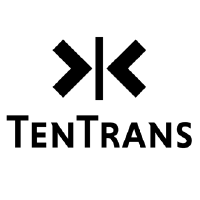

<!-- vscode-markdown-toc -->
<!-- * 1. [项目介绍](#)
* 2. [安装教程](#-1)
* 3. [快速上手预训练模型](#-1)
* 4. [更多任务](#-1)
* 5. [开源协议](#-1)
* 6. [联系方式](#-1) -->

<!-- vscode-markdown-toc-config
	numbering=true
	autoSave=true
	/vscode-markdown-toc-config -->
<!-- /vscode-markdown-toc -->

简体中文｜[English](readme_en.md)
<p align="center">
  
  </br>
  <a href="https://github.com/TenTrans/TenTrans/blob/master/LICENSE"></a>
  <a href="https://github.com/TenTrans/TenTrans/releases"></a>
  <a href="https://github.com/TenTrans/TenTrans/releases"></a>
</p>


-------
## 🔥 项目介绍
TenTrans是一个灵活轻量的自然语言处理训练框架， 支持常见的NLP任务（包括自然语言理解、生成、预训练）。 TenTrans有以下特点:

- 任务原子化： 用户可以任意组合各种NLP任务进行联合训练， 各任务之间的参数可以细粒度地共享。
- 高性能训练： TenTrans支持多机多卡大规模预训练，已在150G以上的超大规模语料上进行预训练验证。
- 多语言及跨语言： TenTrans支持跨语言预训练，用户可以通过迁移学习的方式解决低资源语言语料不足的问题。
- 工业化部署：Tentrans配套高性能的解码器 [TenTrans-Decoding](https://github.com/TenTrans/TenTrans-Decoding), 可直接用于生产环境。

TenTrans目前支持的NLP任务包括
- 自然语言生成（机器翻译）
- 自然语言理解（文本分类,跨语言理解）
- 预训练（MLM、TLM、MASS）

支持特性：
- Transformer
- Bert, XLM
- Distributed training(multi-node, multi-gpu)
- Classification(SST2, SST5)
- Fast beam search
- Average checkpoints and interactive inference


## ⚙️ 安装
```
git clone git@github.com:TenTrans/TenTrans.git
pip install -r requirements.txt 
```
Tentrans是一个基于Pytorch的轻量级工具包，安装十分方便。

## 🚀 快速上手预训练模型
TenTrans支持多种预训练模型，包括基于编码器的预训练（e.g. MLM）和基于seq2seq结构的生成式预训练方法（e.g. Mass）。 此外， Tentrans还支持大规模的多语言机器翻译预训练。

我们将从最简单的MLM预训练开始，让您快速熟悉TenTrans的运行逻辑。

1. 数据处理

在预训练MLM模型时，我们需要对单语训练文件进行二进制化。您可以使用以下命令, 词表的格式为一行一词，执行该命令后会生成train.bpe.en.pth。

```bash
python process.py vocab file  lang [shard_id](optional)
```

当数据规模不大时，您可以使用纯文本格式的csv作为训练文件。csv的文件格式为

| seq1 | lang1 |
| :--- |  ---: |
| This is a positive sentence. | en |
| This is a negtive sentence.| en |
| This is a  sentence.|  en |

2. 参数配置

TenTrans是通过yaml文件的方式读取训练参数的， 我们提供了一系列的适应各个任务的训练配置文件模版（见 **run/** 文件夹），您只要改动很小的一部分参数即可。

```yaml
# base config
langs: [en]
epoch: 15
update_every_epoch:  1   # 每轮更新多少step
dumpdir: ./dumpdir       # 模型及日志文件保存的地方
share_all_task_model: True # 是否共享所有任务的模型参数
save_intereval: 1      # 模型保存间隔
log_interval: 10       # 打印日志间隔


#全局设置开始， 如果tasks内没有定义特定的参数，则将使用全局设置
optimizer: adam 
learning_rate: 0.0001
learning_rate_warmup: 4000
scheduling: warmupexponentialdecay
max_tokens: 2000
group_by_size: False   # 是否对语料对长度排序
max_seq_length: 260    # 模型所能接受的最大句子长度
weight_decay: 0.01
eps: 0.000001
adam_betas: [0.9, 0.999]

sentenceRep:           # 模型编码器设置
  type: transformer #cbow, rnn
  hidden_size: 768
  ff_size: 3072
  dropout: 0.1
  attention_dropout: 0.1
  encoder_layers: 12
  num_lang: 1
  num_heads: 12
  use_langembed: False
  embedd_size: 768
  learned_pos: True
  pretrain_embedd: 
  activation: gelu
#全局设置结束


tasks:                #任务定义， TenTrans支持多种任务联合训练，包括分类，MLM和seq2seq联合训练。
  en_mlm:             #任务ID，  您可以随意定义有含义的标识名
    task_name: mlm    #任务名，  TenTrans会根据指定的任务名进行训练
    data:
        data_folder: your_data_folder
        src_vocab: vocab.txt
        # train_valid_test: [train.bpe.en.csv, valid.bpe.en.csv, test.bpe.en.csv]
        train_valid_test: [train.bpe.en.pth, valid.bpe.en.pth, test.bpe.en.pth]
        stream_text: False  # 是否启动文本流训练
        p_pred_mask_kepp_rand: [0.15, 0.8, 0.1, 0.1]

    target:           # 输出层定义
        sentence_rep_dim: 768
        dropout: 0.1
        share_out_embedd: True
```
3. 启动训练

单机多卡

```shell
export CUDA_VISIBLE_DEVICES=8;
python -m torch.distributed.launch \
                --nproc_per_node=$NPROC_PER_NODE main.py \
                --config run/xlm.yaml --multi_gpu True
```

##  📋 更多任务
 - [文本分类（SST2）](examples/TASK/SST2.md) 
 - [机器翻译（WMT14ENDE）](examples/TASK/WMTENDE.md)

## 🔑 开源协议
此项目遵循MIT开源协议


## 🙋‍♂️ 联系我们
如果在使用本项目过程中出现问题或想要进一步的交流，可以联系Baijun Ji(begosu@foxmail.com; baijunji@tencent.com) ，Bojie Hu(bojiehu@tencent.com)，Ambyera(ambyera@tencent.com）。


